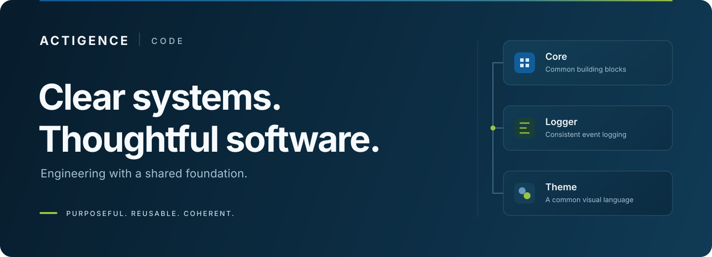

  <a href="https://actigence.eu"><strong>Discover Actigence</strong></a>
  &nbsp; · &nbsp;
  <a href="https://github.com/orgs/Actigence-Code/repositories">Browse repositories</a>
  &nbsp; · &nbsp;
  <a href="../SECURITY.md">Security</a>

## Software that belongs together

Actigence Code brings together the software behind Actigence: practical applications, reusable components, and tools that make everyday work clearer. Each product has its own purpose. Common foundations give the whole a consistent structure, vocabulary, and experience.

### One foundation, many applications

| Core | Logger | Theme |
| :--- | :--- | :--- |
| **Build on what is shared.** | **Make behavior understandable.** | **Keep the experience coherent.** |
| Product-neutral building blocks and conventions that belong in a common home. | Structured events and contextual logging for Python applications, with deliberate control over sensitive data. | Visual tokens, typography, and appearance patterns that give interfaces a common language. |

### Where we build

**Business applications** — Workflows, operational tools, and focused interfaces that turn complex processes into usable software.

**Information and decisions** — Structured data, useful reporting, and clear relationships between inputs, actions, and outcomes.

**Developer experience** — Automation, integration utilities, and shared foundations that make software easier to understand and maintain.

### How we work

We keep reusable engineering in shared foundations and domain decisions in the products that own them. We value readable code, useful documentation, explicit boundaries, and checks that demonstrate what actually works. Privacy belongs in the design of examples, logs, and support conversations.

---

[Contribution guide](../CONTRIBUTING.md) · [Code of conduct](../CODE_OF_CONDUCT.md) · [Report a vulnerability](../SECURITY.md) · [Get support](../SUPPORT.md)
